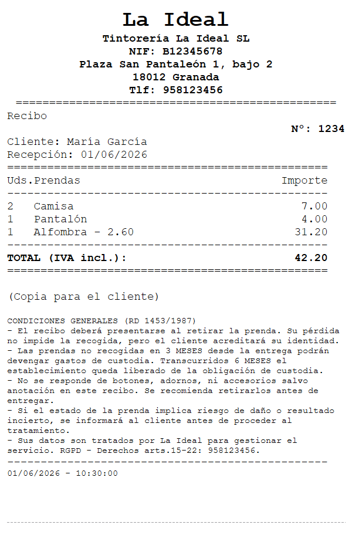
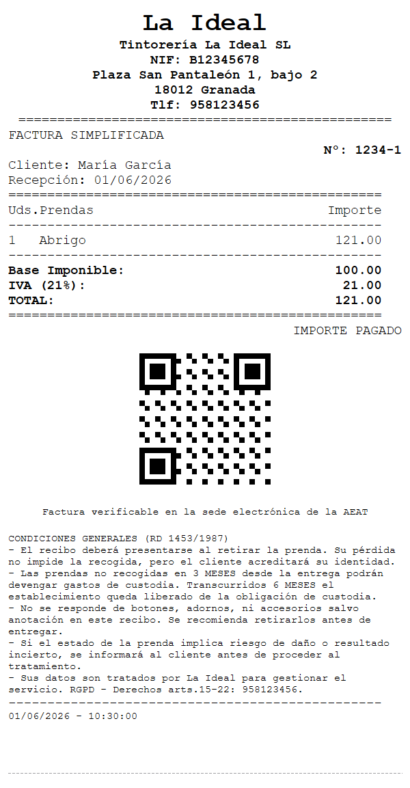

# Printer Research — Direct ESC/POS Ticket Printing

This folder is the research dossier and implementation plan that backed replacing the
Excel-based ticket/invoice printing with direct communication to the shop's thermal
receipt printer. It originally backed the Open Non-Blocking issue **"Replace Excel-based
printing with EPSON ticket printer API"** in [`../../progress_tracker.md`](../../progress_tracker.md).

Status: **implemented.** The recommended path below shipped as the `src/printing/` library
(`EscPosBuilder` + `TicketRenderer` + `ThermalPrinter`), wired into `src/imprimir`; the
Excel/QXlsx/`.vbs`/`cscript` path is gone. The runtime reference for the shipped code is
[`../printing.md`](../printing.md); this dossier remains the design background (model,
control-method rationale, the exact ESC/POS command subset, and the original phased plan).
Phase 0 (hardware validation on the shop's TM-T20III), Phase 4 (the optional Status-API layer,
behind `print.use_status_api`) and Phase 5 (removing the vendored `QXlsx/`) are all done; the
Status-API's ASB bit values + DLL path still need confirming on the physical unit.

## The printer, in one line

The shop uses an **Epson TM-T20III** thermal receipt printer (203 dpi, 80/58 mm roll,
auto-cutter). It speaks Epson **ESC/POS** — a binary command protocol — and is already
installed as a Windows printer queue. We do not need Excel, QXlsx, COM, or `cscript` to
drive it.

## The recommendation, in one paragraph

Build the receipt as an **ESC/POS byte stream in C++** and send it as **RAW data through the
Windows print spooler** (`OpenPrinterW` → `StartDocPrinterW` with datatype `RAW` →
`WritePrinter` → `EndDocPrinter`). This removes Excel, QXlsx, the generated VBScript and the
`cscript` subprocess entirely; needs no Epson SDK/DLL (only `winspool`, already on every
Windows box); is effectively instant compared to launching Excel; and keeps working against
the existing installed printer queue. The Epson **Status API** (`BiDirectIOEx`/`BiGetStatus`)
is an optional later enhancement for paper-out/cover-open detection. See
[`05_implementation_plan.md`](05_implementation_plan.md) for the full design.

## Sample rendered output

These are generated from the **real `TicketRenderer` ESC/POS output** by the
`test_ticket_preview` suite (it interprets the byte stream back into a PNG
simulation of the thermal paper), at the 80 mm / 576-dot width. They are a
layout/content preview — the physical TM-T20III uses its own built-in font, so
on-paper spacing differs slightly. Regenerate with `ctest -R ticket_preview`
(writes `preview_*.png`/`.txt` to `build/tests/`) and copy the PNGs here if the
layout changes.

| Recibo (claim ticket) | Factura simplificada (with Verifactu QR) |
|:---:|:---:|
|  |  |

## Read in this order

| File | What it covers |
|------|----------------|
| [`01_printer_model_and_specs.md`](01_printer_model_and_specs.md) | Exact model identification, hardware/print specs, interfaces, and an inventory of the local documentation in `C:\Users\gebra\work\tintoreria\impresora`. |
| [`02_control_methods.md`](02_control_methods.md) | Every documented way to talk to the printer (direct ESC/POS via RAW spooler, Epson Status API, APD raster/GDI, OPOS, ePOS-Print XML), with a pros/cons matrix and the rationale for the choice. |
| [`03_escpos_command_reference.md`](03_escpos_command_reference.md) | The concrete ESC/POS command subset La Ideal needs, with exact byte sequences: init, text style, alignment, fonts, code pages (Spanish accents), cut, raster image, native QR, barcodes, status. |
| [`04_current_printing_flow.md`](04_current_printing_flow.md) | How printing works today (QXlsx → `.xlsx` → VBScript → Excel COM → default printer), the exact receipt/invoice layout to reproduce, and the full integration surface (callers + settings). |
| [`05_implementation_plan.md`](05_implementation_plan.md) | Proposed module design, public API, transport layer, settings additions, phased delivery plan, testing strategy, and risks. |

## Sources

- Local PDFs and SDKs under `C:\Users\gebra\work\tintoreria\impresora` (Technical Reference
  Guide, User's Guide, APD 6.04 driver + Printer Specification, Status API manual, sample
  programs, OPOS ADK). Inventoried in [`01_printer_model_and_specs.md`](01_printer_model_and_specs.md).
- Epson ESC/POS Command Reference (the public site `reference.epson-biz.com` was retired on
  2024-06-16; the docs now live at `https://support.epson.net/publist/reference_en/?ref=escpos`,
  and the model command list at the `download4.epson.biz/.../escpos/tmt20iii.html` mirror).
- Practical ESC/POS write-ups: mike42.me ("What is ESC/POS, and how do I use it?"), the
  Pyramid ESC/POS command table, and Microsoft Learn "Epson ESC/POS with formatting".
